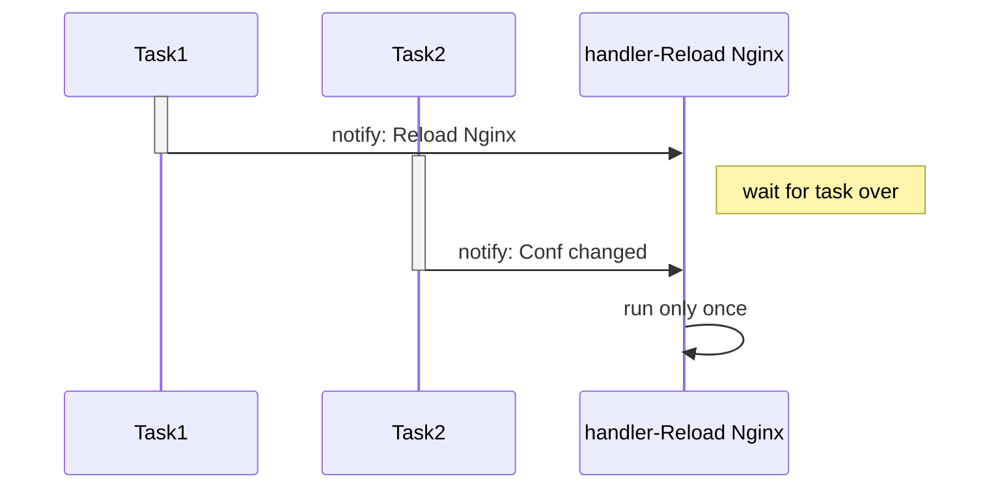
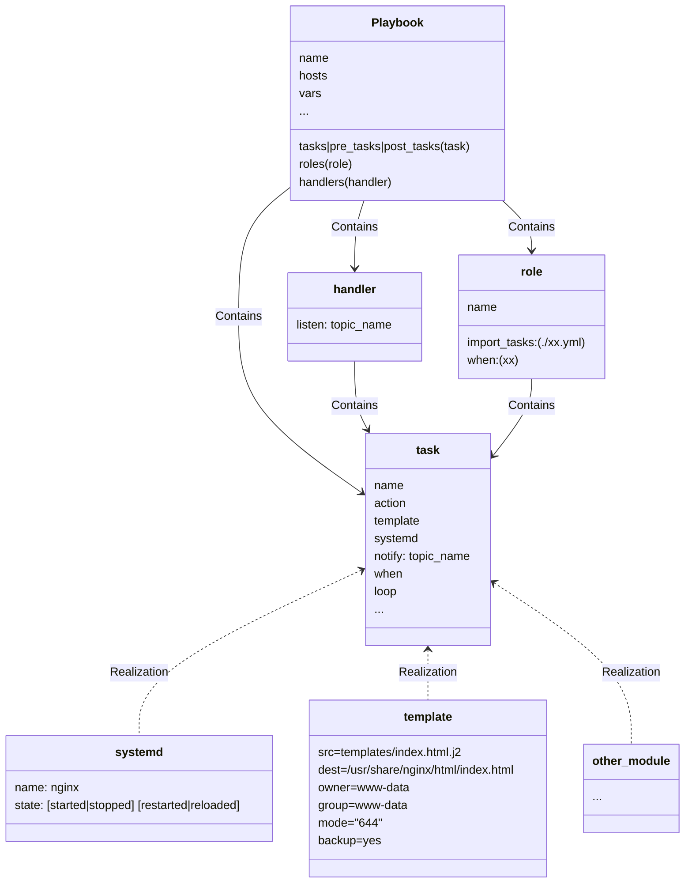

## handlers 

```mermaid
sequenceDiagram
	participant Task1
    participant Task2
    activate Task1
    Task1->>handler-Reload Nginx: notify: Reload Nginx
	deactivate Task1
    activate Task2
    Note right of handler-Reload Nginx: wait for task over
	Task2->>handler-Reload Nginx: notify: Conf changed
    deactivate Task2
	handler-Reload Nginx->>handler-Reload Nginx: run only once
	
```

## 常见概念关系

```mermaid
classDiagram
    class Playbook{
        name
        hosts
        vars
        tasks|pre_tasks|post_tasks(task)
        roles(role)
        handlers(handler)
        ...
    }
    class task{
        name
        action
        template
        systemd
        notify: topic_name
        when
        loop
        ...
	}
    class handler{
		listen: topic_name
	}
    class role{
		name
		import_tasks:(./xx.yml)
		when:(xx)
	}
    class systemd{
        name: nginx
        state: [started|stopped] [restarted|reloaded]
	}
    class template{
        src=templates/index.html.j2
        dest=/usr/share/nginx/html/index.html
        owner=www-data
        group=www-data
        mode="644"
        backup=yes
	}
    class other_module{
		...
	}
	Playbook --> task : Contains
	Playbook --> handler : Contains
	handler --> task : Contains
	Playbook --> role : Contains
	role --> task : Contains
    task <.. systemd : Realization
	task <.. template : Realization
    task <.. other_module : Realization
```

## Todo

- local repo

- starting, stopping, undeploying it

- ####  add a new backend server "apache" to haproxy based on task-2

